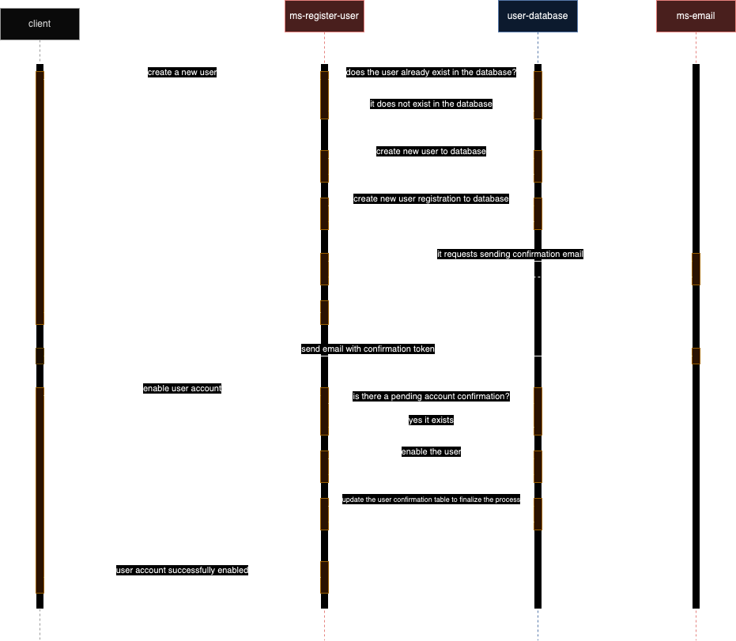

# ms-register-user

This microservice is responsible for registering users.

## Database 

This microservice consumes the data from [user_database](https://github.com/leojaimesson/user-database).

## Happy path sequence diagram

